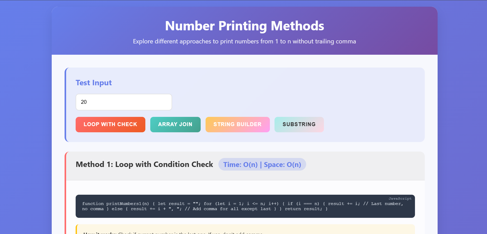
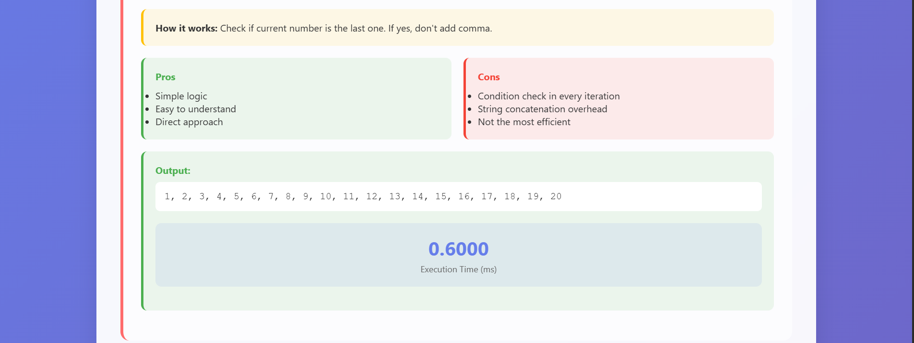
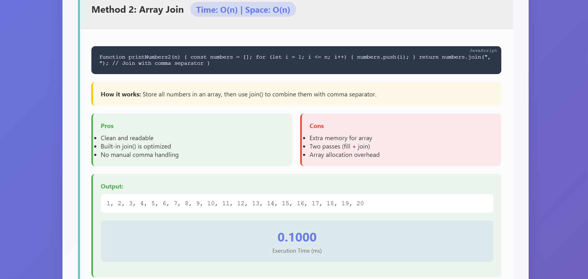
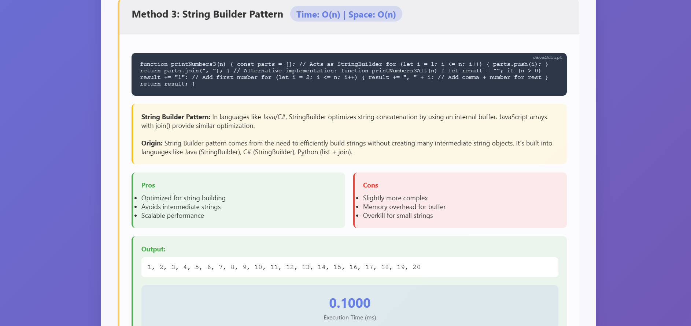
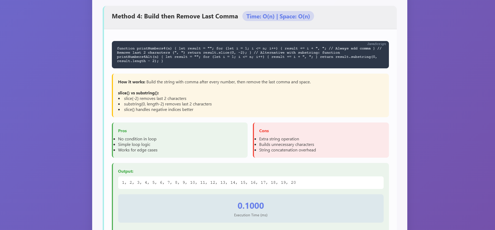
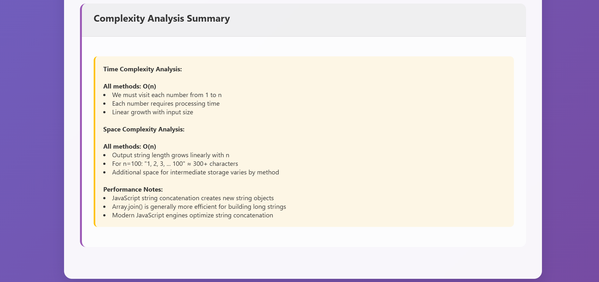

# 🔢 Number Printing Methods from 1 to n (Without Trailing Comma)

This repository explores **4 different methods** to print numbers from `1 to n` without a trailing comma. Each method is explained with pros, cons, and performance analysis.

---

## 🖼️ Screenshots

### 🔢 Method 1: Loop with Condition Check


### 📦 Method 2: Array Join


### 🧱 Method 3: String Builder


### ✂️ Method 4: Build Then Remove


### ⚙️ Performance Comparison


### 📊 Complexity Summary

## 🚀 Methods

### 1. Loop with Condition Check

- Checks if the current number is the last.
- Adds a comma only if it's **not** the last number.

```js
let result = "";
for (let i = 1; i <= n; i++) {
  result += (i === n) ? i : i + ", ";
}
✅ Simple logic
❌ Extra condition check every loop

2. Array Join
Stores numbers in an array.

Uses .join(", ") to generate the final string.

const numbers = [];
for (let i = 1; i <= n; i++) {
  numbers.push(i);
}
return numbers.join(", ");
✅ Clean and readable
❌ Memory overhead (temporary array)

3. String Builder Pattern
Uses an array as a string builder.

Inspired by StringBuilder in Java/C#.


const parts = [];
for (let i = 1; i <= n; i++) {
  parts.push(i);
}
return parts.join(", ");
✅ Efficient string construction
❌ Slight complexity overhead

4. Build Then Remove (Slice)
Builds the entire string with commas.

Removes the final comma and space using .slice().


let result = "";
for (let i = 1; i <= n; i++) {
  result += i + ", ";
}
return result.slice(0, -2); // Remove last ", "
✅ No conditions inside the loop
❌ Builds extra characters unnecessarily

⚙️ Complexity Analysis
Time Complexity: O(n)
All methods iterate from 1 to n

Each number requires some form of processing

Space Complexity: O(n)
Final string grows linearly with n

Some methods use additional memory (arrays)

🔧 The String Builder Pattern
Where It Comes From:
JavaScript	Array + .join()

Why It Matters:
Avoids excessive temporary string creation

Improves performance in large string operations

Scales well with high n values

📊 Summary

| Method            | Pros                  | Cons                  |
| ----------------- | --------------------- | --------------------- |
| Loop with Check   | Easy to understand    | Extra condition check |
| Array Join        | Clean, optimized join | Memory overhead       |
| String Builder    | High performance      | More complex          |
| Build then Remove | Simple loop           | Removes extra at end  |


💡 Try it Yourself
Each method can be tested and timed to compare performance. Great for learning about performance optimization, memory usage, and string manipulation patterns!
