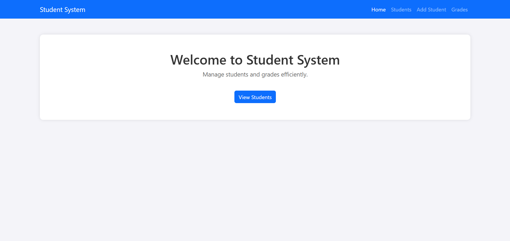
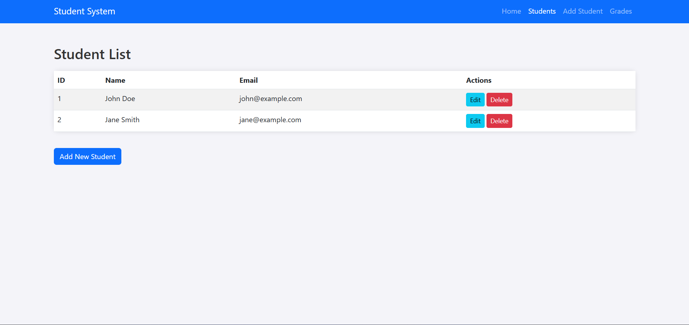
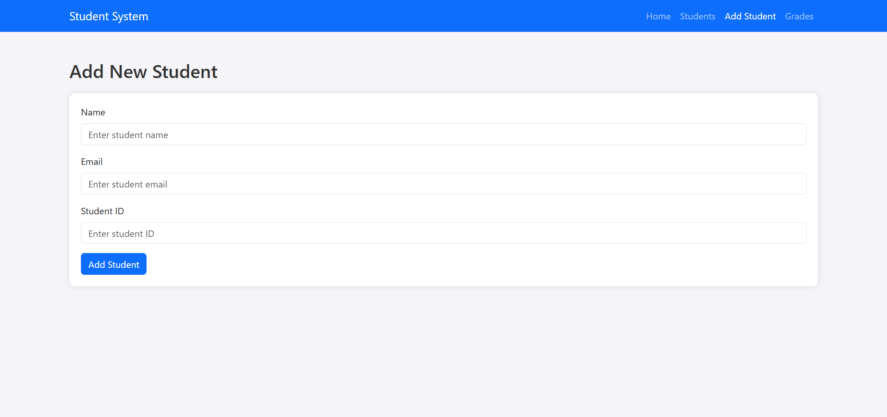
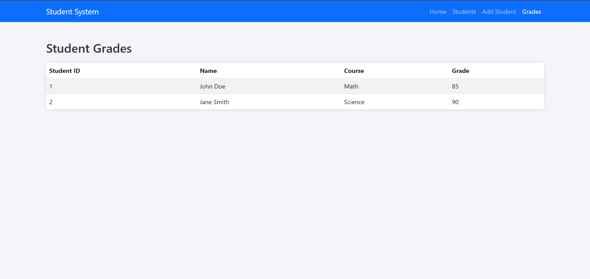

# 🎓 Student Affairs Management System

A simple static **Student Affairs System** built using **HTML**, **CSS**, and **Bootstrap**.  
The project allows basic operations like viewing students, adding new records, and displaying academic grades.  
All styles are applied using **inline styling only**, as per the project requirements.

---

## 📁 Project Structure

Student_Affairs_System/
│
├── AddStudent.html ← Page to add a new student with a form
├── GradesPage.html ← Page to display student grades
├── index.html ← Home page (welcome Home Page screen)
└── StudentsPage.html ← Page to list student details with Edit and Delete

---

## 🌐 Technologies Used

- **HTML5**
- **CSS3**
- **Bootstrap 5** (via CDN)
- **Inline Styling Only** (no external CSS files)

---

## 📄 Pages Overview

### 🏠 `index.html`
- Welcome or dashboard page.
- Acts as the entry point of the system.

### 🧾 `AddStudent.html`
- Contains a student registration form.
- Fields include: Student Name, ID, Age, and Class.

### 👨‍🎓 `StudentsPage.html`
- Displays all student records in a Bootstrap-styled table.
- Includes placeholder buttons for Edit and Delete actions.

### 📊 `GradesPage.html`
- Displays students' grades in a tabular layout.

---

## ✅ Features

- Clean and user-friendly interface
- Fully responsive layout using Bootstrap 5
- Static-only system (no JavaScript functionality)
- All styles are applied inline per project instructions

---

## 📸 Screenshots

### 🏠 Home Page

### 👨‍🎓 Students Page

### 🧾 Add Student Page

### 📊 Grades Page

---
## 📌 Notes

- This project is built as a **frontend-only static prototype**.
- It’s ideal for demonstrating UI structure and Bootstrap layout without backend logic or dynamic interaction.

