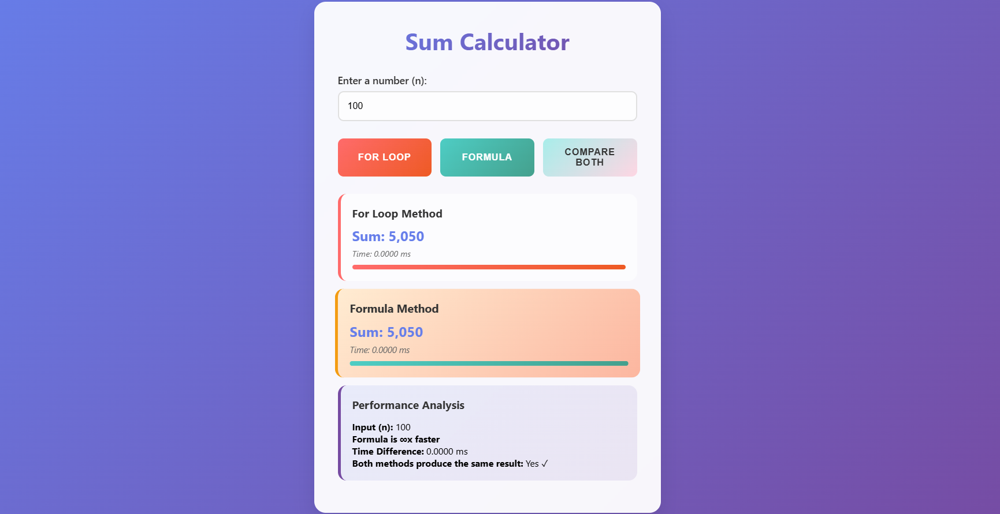

# 🔢 Sum Calculator & Performance Comparison

A responsive web tool to **calculate the sum of numbers from 1 to _n_** using two methods — **for loop** and **mathematical formula** — with real-time **performance measurement**, **input validation**, and visual comparison.

### 📸 Screenshot

---

## 🚀 Features

### 🔁 Two Calculation Methods
- **For Loop:** Iteratively sums numbers from 1 to _n_
- **Formula:** Uses the mathematical equation: _n(n + 1) / 2_

### ⚡ CPU Performance Test
- Uses `performance.now()` to measure execution time precisely
- Compares both methods and highlights the faster one
- Visual performance bars to illustrate timing differences

### ✅ Comprehensive Input Validation
- Ensures the input is:
  - Not empty
  - A valid number
  - A positive integer
  - Within a reasonable limit (to avoid browser freezing)
- Displays clear and user-friendly error messages

### 🎨 Modern UI/UX Design
- Gradient backgrounds and clean card layout
- Hover effects and smooth animations
- Loading spinner during calculations
- Fully responsive design for all devices

### ⌨️ Enhanced Usability
- Press `Enter` to trigger comparison
- Thousands separator for large numbers
- Dynamic result cards with performance highlights
- Shows execution time difference and result match

---

## 📁 Folder Structure

Sum_Validation_Comparison/
│
├── index.html # Main HTML page
├── style.css # Styling (CSS)
├── logic.js # JavaScript logic
└── assets/
└── image.png # Project screenshot

---

## 💡 Why This Project?

This tool demonstrates both basic and advanced JavaScript concepts, including:

- DOM manipulation
- Performance benchmarking
- Real-time validation
- Visual feedback and comparison

It’s ideal for:
- Frontend development practice
- Teaching algorithms and time complexity
- Demonstrating iteration vs formula-based solutions

---

## 🧠 Insights

While both methods produce the same result, their performance differs significantly for large values of _n_.  
The **formula-based method is drastically faster**, since it uses a constant-time operation (O(1)) vs the loop’s linear time (O(n)) — and this difference is visually highlighted in the UI.

---